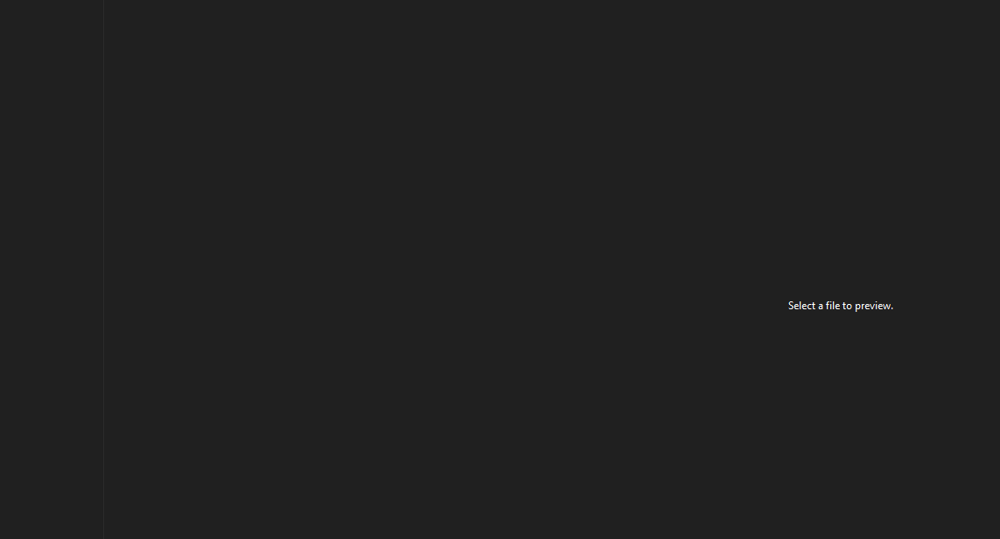

# README.md Generator

This command line applications allows users to quickly create a README file for their applications. Users have options as to what they would like to include in their readme. This readme was generated with this application and includes all the possible sections 
The image below is what will generate with all optional sections disabled.

## Table of Contents

* [Installation](#installation)
* [Usage](#usage)
* [Questions](#Questions?)
* [Collaborators](#collaborators)
* [License](#license)

## Usage

- This application relies on moment and inquirer npm packages
- Once Installation is complete, using a terminal navigate to the installation directory
- Type `npm start`

## Installation

- Use GitHub's feature set to get the files on your local machine
- It is easiset to clone this repository using you SSH key
- In your command line, navigate to the application directory and type nmp i to install the necessary modules

## Questions?

For any inquiries or feedback, please reach me at [Diegopie](https://github.com/Diegopie)
 or at diegopie@outlook.com
## Collaborators

This application relies on Inquirer NPM and Moment NPM.
Thank you to [Clarissa R](https://github.com/clarissareeve) for helping me get started with this project!

## License

MIT License
Copyright (c) 2020 Diegopie